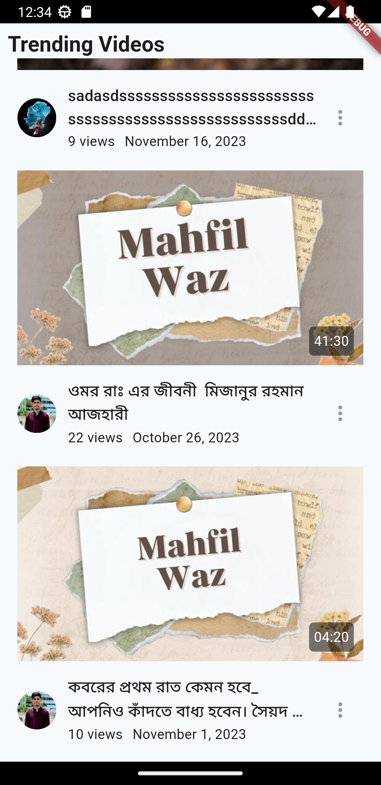
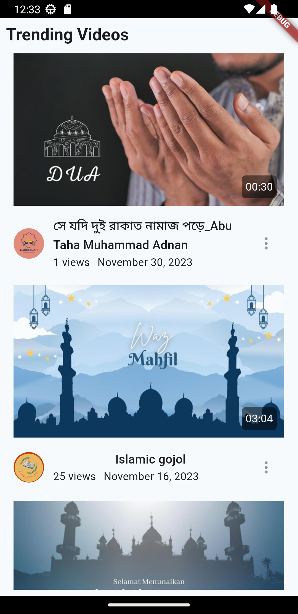
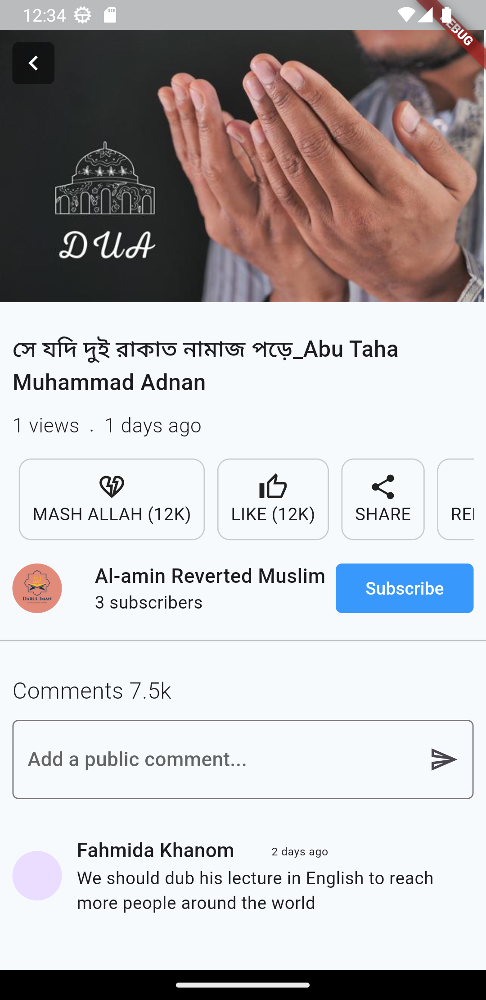

# Simple Video Player App

A simple video player app tasks from qtech

---

## Getting Started 🚀

At first clone the repo

```
git clone https://github.com/RomjanHossain/Simple-video-player-app.git
```

then move to the project root directory.

```
cd Simple-video-player-app
```

After that you have to get all the packages first

```
flutter pub get
```

then you've to generate freezed and json serializer files

```
dart run build_runner build
```

After successfully generated all the files you can run any of the 3 flavors of the app.

Flavors:

- development
- staging
- production

To run the desired flavor either use the launch configuration in VSCode/Android Studio or use the following commands:

```sh
# Development
$ flutter run --flavor development --target lib/main_development.dart

# Staging
$ flutter run --flavor staging --target lib/main_staging.dart

# Production
$ flutter run --flavor production --target lib/main_production.dart
```

Here's some screenshot of the app:






_Note: You have to click the thumbnail [to play the video](https://github.com/RomjanHossain/Simple-video-player-app/blob/464fe5988a9973a0d3cf015dc0ca72eb2a17f343/lib/presentation/pages/view_video/components/play_video.dart#L38)_

_\*Simple Video Player App works on iOS, Android, Web, Windows and Linux._

---
